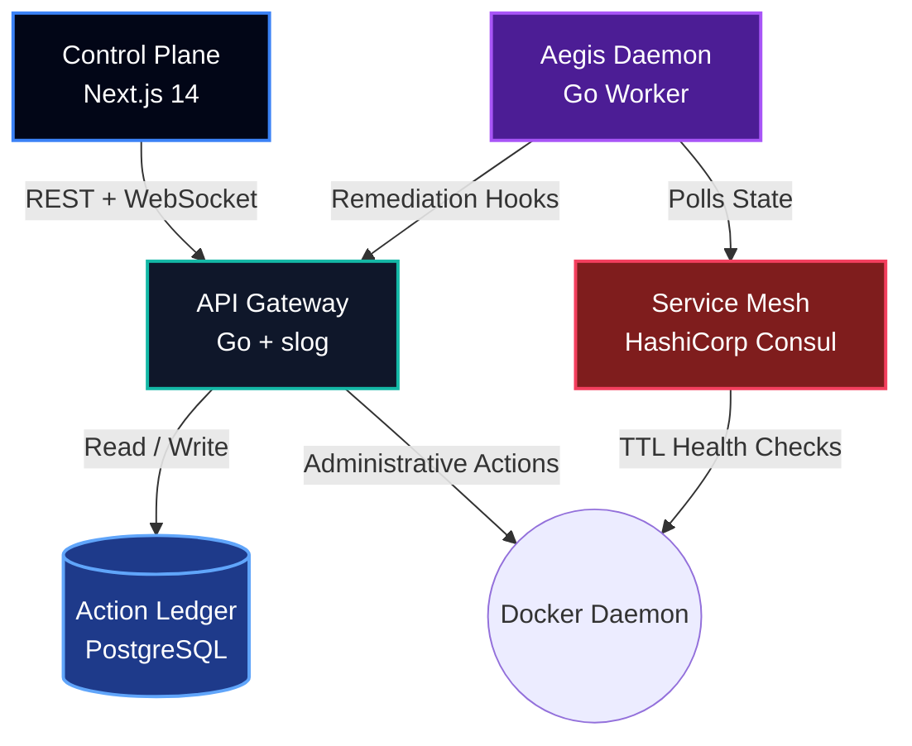

# Aegis Mesh

<div align="center">

<a href="https://skillicons.dev">
  
</a>

<br><br>

<pre>
    _    _____ ____ ___ ____    __  __ _____ ____  _   _
   / \  | ____/ ___|_ _/ ___|  |  \/  | ____/ ___|| | | |
  / _ \ |  _|| |  _ | |\___ \  | |\/| |  _| \___ \| |_| |
 / ___ \| |__| |_| || | ___) | | |  | | |___ ___) |  _  |
/_/   \_\_____\____|___|____/  |_|  |_|_____|____/|_| |_|
</pre>

<a href="#">
  
</a>

<br>

[](#)
[](#)
[](#)
[](https://opensource.org/licenses/MIT)

*An event-driven SRE daemon that monitors microservices, autonomously diagnoses root causes using AI heuristics, and executes zero-touch remediation before human intervention is required.*

<br>


</div>

---

# 📖 Table of Contents

1. [The Philosophy: Problem vs. Solution](#-the-philosophy-problem-vs-solution)
2. [Enterprise Capabilities](#-enterprise-capabilities)
3. [System Architecture](#-system-architecture)
4. [Component Deep-Dive](#-component-deep-dive)
5. [The Autonomous AI Engine](#-the-autonomous-ai-engine)
6. [API & Webhook Reference](#-api--webhook-reference)
7. [Zero-Dependency Quickstart](#-zero-dependency-quickstart)
8. [Day 2 Operations](#-day-2-operations)
9. [Troubleshooting Guide](#-troubleshooting-guide)
10. [Roadmap & Limitations](#-roadmap--limitations)
11. [Contributing](#-contributing)
12. [License](#-license)

---

# ⚡ The Philosophy: Problem vs. Solution

Modern microservice architectures are highly resilient but notoriously brittle under cascading load. When a Node.js gateway leaks memory or a PostgreSQL connection pool exhausts, human Site Reliability Engineers (SREs) must manually parse logs, identify the failing container, and execute a restart. In a high-availability environment, this human latency costs thousands of dollars in downtime.

**Aegis Mesh eliminates the human bottleneck through the "Aegis Doctrine": Detect, Diagnose, Execute, and Audit.**

| Feature | Traditional Operations | The Aegis Approach |
|----------|------------------------|--------------------|
| **Detection** | Humans waiting for PagerDuty alerts | **Sub-second anomaly detection** via Consul Mesh polling |
| **Diagnosis** | Manually `grep`-ing through Kibana logs | **Automated AI Root Cause Analysis** directly from `stderr` |
| **Remediation** | SSH-ing into servers to run `docker restart` | Secure Go APIs execute host-level remediation |
| **Auditing** | Fragmented Slack channel histories | **Cryptographic immutable logging** in PostgreSQL |

---

# 🛠 Enterprise Capabilities

### 🧠 Heuristic AI Diagnosis
Generates high-confidence remediation plans using weighted failure analysis and stack trace inspection.

### ⚖️ Dynamic Auto-Scaling
Horizontally scales overloaded containers, provisions networking, and updates service registration automatically.

### 🐒 Native Chaos Protocol
Built-in Chaos Engineering toolkit capable of:

- Network degradation
- Random container termination
- Latency injection
- Packet loss simulation

### 📡 Multiplexed Telemetry
Streams real-time Docker logs securely to operators using WebSocket multiplexing.

### 🛡️ Graceful Degradation Engine
Includes:

- Context propagation
- Exponential jittered backoff
- Circuit breaking
- Prometheus metrics export

---

# 🏗 System Architecture



---

# 🔍 Component Deep-Dive

## 1. Control Plane (`frontend/`)

Built with **Next.js 14**, the dashboard provides:

- Real-time service telemetry
- WebSocket event streaming
- Fleet monitoring
- Incident forensics

### Features

- React Server Components
- Client-side WebSocket hydration
- Timezone-safe rendering
- Live audit trail

---

## 2. API Gateway (`backend/`)

Written in **Go 1.21+**.

Acts as the centralized command broker responsible for:

- REST APIs
- WebSocket streams
- Docker orchestration
- Audit logging

### Highlights

- Structured logging using `log/slog`
- CORS handling
- Host daemon interaction
- Remediation execution

---

## 3. Aegis Daemon (`openclaw/`)

The autonomous SRE brain.

Responsibilities:

- Poll Consul every 4 seconds
- Analyze health signals
- Generate remediation plans
- Trigger automated recovery

### Failure Handling

Backoff progression:

```text
2s → 4s → 8s → 16s → 32s
```

Prevents thundering herd failures during infrastructure outages.

---

## 4. Service Mesh (`consul/`)

HashiCorp Consul maintains infrastructure state.

Features:

- Service discovery
- Health checking
- TTL registrations
- Fleet membership tracking

---

## 5. Immutable Ledger (`postgres/`)

Stores all executed actions for forensic auditing.

### Recorded Metadata

- Timestamp
- Service Name
- Action Executed
- Operator Identity
- Payload Hash
- Outcome

---

# 🤖 The Autonomous AI Engine

Rather than relying exclusively on procedural decision trees, Aegis Mesh utilizes a weighted heuristic analysis engine.

When a node enters a degraded state:

1. Logs are collected
2. Health metrics are aggregated
3. Failure signatures are matched
4. Confidence scores are generated
5. Remediation plans are proposed

### Example Output

```json
{
  "service": "payment-api",
  "diagnosis": "Stripe API gateway timeout. Goroutine leak detected in connection pool resulting in OOM kill.",
  "confidence": "94.2%",
  "recommendation": "Execute graceful SIGTERM. Flush Redis cache and provision secondary replica before reboot."
}
```

---

# 🔌 API & Webhook Reference

## WebSocket Telemetry

```http
GET /api/logs?container={container_name}

Connection: Upgrade
Upgrade: websocket
```

---

## Autonomous Remediation Webhook

```http
POST /api/remediate
Content-Type: application/json
```

Payload:

```json
{
  "service_name": "inventory-db",
  "issue": "PostgreSQL connection pool exhausted. Active connections exceeded 100 limit.",
  "action": "evaluate_remediation_heuristics"
}
```

---

# 🚀 Zero-Dependency Quickstart

The platform uses optimized multi-stage Alpine Docker builds.

### Prerequisites

- Docker Engine ≥ 24.0
- Docker Compose ≥ 2.20
- GNU Make

---

## 1. Clone & Boot

```bash
git clone https://github.com/your-username/agentops-platform.git

cd agentops-platform

make up
```

This command:

- Builds binaries
- Creates networks
- Initializes databases
- Starts the entire stack

---

## 2. Seed the Mesh

```bash
make seed
```

Injects mock services into Consul for testing.

---

## 3. Access the Platform

| Service | URL |
|----------|------|
| Control Plane | http://localhost:3000 |
| Prometheus Metrics | http://localhost:9091/metrics |
| Consul UI | http://localhost:8500/ui |

---

# 🛠 Day 2 Operations

| Command | Description |
|----------|-------------|
| `make up` | Boot the stack |
| `make rebuild` | Force clean compilation |
| `make logs` | Stream daemon logs |
| `make clean` | Factory reset everything |

---

# ⚠️ Troubleshooting Guide

## 1. Address Already In Use

Ports:

- 3000
- 8080
- 8500
- 5432

may already be occupied.

### Fix

```bash
docker ps

docker stop <container-id>
```

Or modify `docker-compose.yml`.

---

## 2. Go Dependency Panics (Moby Trap)

If local builds fail with Docker SDK dependency errors:

### Fix

Always build using Docker:

```bash
make rebuild
```

This ensures dependency resolution occurs inside the supported build environment.

---

## 3. Ghost Nodes in Dashboard

Cause:

Persistent Consul volumes retaining stale service registrations.

### Fix

```bash
make clean

make up

make seed
```

---

# 🗺 Roadmap & Limitations

## Current Limitations

### Docker Socket Mounting

The backend mounts:

```text
/var/run/docker.sock
```

This is acceptable for local orchestration but unsuitable for multi-tenant production deployments.

### Single Node Consul

Current development mode runs a single Consul instance.

Production deployments should use:

```text
3–5 Consul servers
```

to prevent split-brain scenarios.

---

## Future Targets (v7.0)

### Kubernetes Migration

- Replace Docker daemon interactions
- Adopt `client-go`
- Manage Pods natively

### True LLM Analysis

- Token-bucket rate limiting
- Semantic log analysis
- AI-assisted incident response

### Distributed Ledger

Migrate from:

```text
PostgreSQL
```

to:

```text
CockroachDB
```

for resilient audit storage.

### SlackOps Integration

- Mobile approvals
- Interactive remediation workflows
- Persistent webhook connectivity

---

# 🤝 Contributing

Pull requests are welcome.

### Workflow

```bash
# Fork repository

git checkout -b feature/amazing-feature

git commit -m "feat: add amazing feature"

git push origin feature/amazing-feature
```

Then open a Pull Request.

### Development Tip

```bash
make clean
```

frequently during testing to maintain a clean environment.

---

# 📜 License

Distributed under the MIT License.

Built with ❤️, Go, Docker, PostgreSQL, and Next.js.

---

<div align="center">

### Aegis Mesh

**Detect → Diagnose → Execute → Audit**

*Autonomous Infrastructure Reliability Platform*

</div>