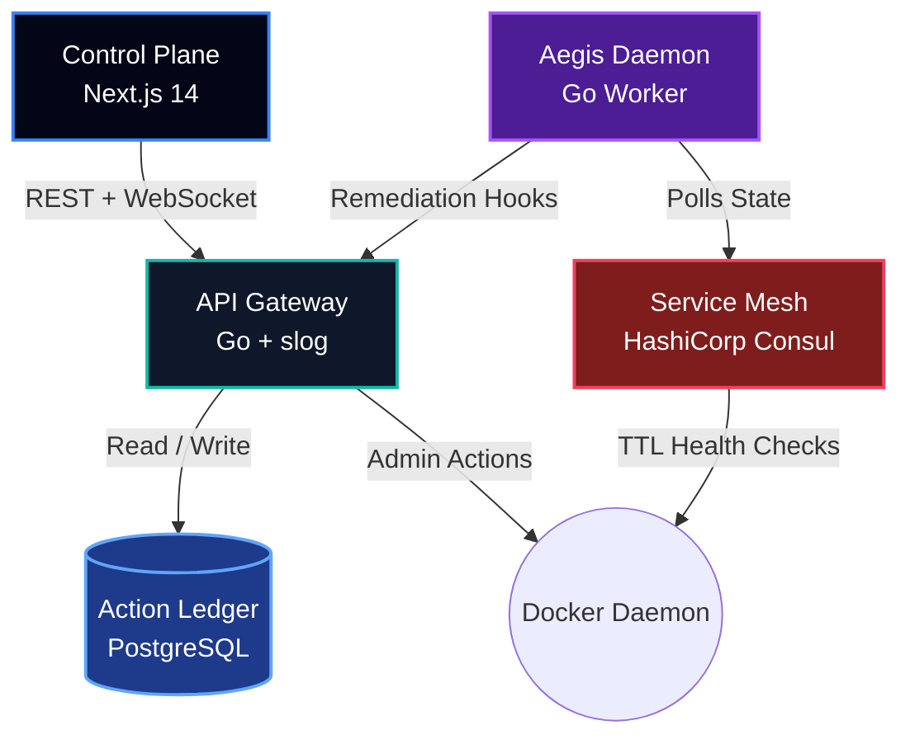

<div align="center">


[](#)
[](#)
[](#)
[](https://opensource.org/licenses/MIT)

*An event-driven SRE daemon that watches your microservices, diagnoses root causes with AI heuristics, and remediates before a human has to.*

</div>

## Detect → Diagnose → Execute → Audit

| | Traditional Ops | Aegis Mesh |
|---|---|---|
| **Detect** | Wait for a PagerDuty alert | Sub-second Consul mesh polling |
| **Diagnose** | Grep through Kibana | Automated AI root-cause analysis |
| **Remediate** | SSH in, `docker restart` | Secure Go API executes the fix |
| **Audit** | Scattered Slack threads | Immutable PostgreSQL ledger |

## Architecture



| Component | Path | Stack | Role |
|---|---|---|---|
| Control Plane | `frontend/` | Next.js 14 | Live telemetry, fleet view, incident forensics |
| API Gateway | `backend/` | Go 1.21+ | REST/WebSocket broker, Docker orchestration, audit writes |
| Aegis Daemon | `openclaw/` | Go | Polls Consul every 4s, proposes & triggers remediation |
| Service Mesh | Consul | HashiCorp Consul | Discovery, health checks, TTL registration |
| Action Ledger | `postgres/` | PostgreSQL | Immutable record of every action taken |

## Capabilities

- **Heuristic AI diagnosis** — weighted failure analysis from stack traces and logs
- **Dynamic auto-scaling** — clones overloaded services and re-registers them in the mesh
- **Native chaos protocol** — random kills, latency injection, packet loss, network degradation
- **Multiplexed telemetry** — live container logs over WebSocket
- **Graceful degradation** — context propagation, jittered exponential backoff, circuit breaking, Prometheus metrics

Backoff progression on Consul/network failure: `2s → 4s → 8s → 16s → 32s`, preventing thundering-herd retries.

## AI Diagnosis Engine

Each degraded node is scored against known failure signatures to produce a confidence-rated remediation plan:

```json
{
  "service": "payment-api",
  "diagnosis": "Stripe API gateway timeout. Goroutine leak detected in connection pool resulting in OOM kill.",
  "confidence": "94.2%",
  "recommendation": "Execute graceful SIGTERM. Flush Redis cache and provision secondary replica before reboot."
}
```

## API

```http
GET /api/logs?container={container_name}      # WebSocket log stream
POST /api/remediate                            # Trigger remediation
Content-Type: application/json

{ "service_name": "inventory-db", "issue": "...", "action": "evaluate_remediation_heuristics" }
```

## Quickstart

Requires Docker Engine ≥ 24.0, Docker Compose ≥ 2.20, GNU Make.

```bash
git clone https://github.com/your-username/agentops-platform.git
cd agentops-platform
make up      # build, network, init db, boot the stack
make seed    # inject mock services into Consul
```

| Service | URL |
|---|---|
| Control Plane | http://localhost:3000 |
| Prometheus | http://localhost:9091/metrics |
| Consul UI | http://localhost:8500/ui |

## Day-2 Ops

| Command | Effect |
|---|---|
| `make up` | Boot the stack |
| `make rebuild` | Force clean recompile |
| `make logs` | Stream daemon logs |
| `make clean` | Full reset |

## Troubleshooting

| Symptom | Fix |
|---|---|
| Port already in use (3000/8080/8500/5432) | `docker ps` → `docker stop <id>`, or remap in `docker-compose.yml` |
| Docker SDK build errors locally | Build inside Docker only — `make rebuild` |
| Ghost nodes in dashboard | Stale Consul volume → `make clean && make up && make seed` |

## Roadmap

- Kubernetes migration via `client-go`
- True LLM-based semantic log analysis with rate limiting
- Move the ledger from PostgreSQL to CockroachDB
- Mobile-friendly SlackOps approvals

## Contributing & License

PRs welcome — fork, branch, commit, open a PR. Distributed under the MIT License.

<div align="center">

**Aegis Mesh** — Autonomous Infrastructure Reliability Platform

</div>